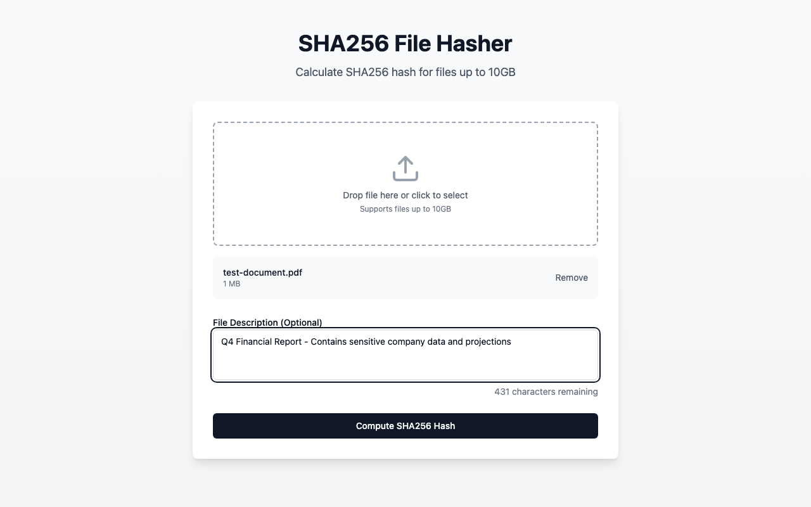
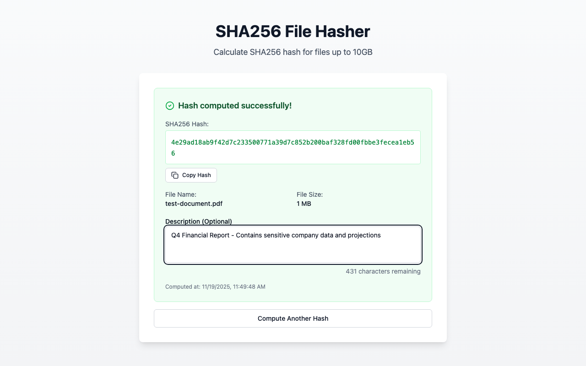

# SHA256 File Hasher

A TypeScript React application that calculates SHA256 hashes for files up to 10GB with a non-blocking UI.

## Features

- ✅ SHA256 hash calculation for files up to 10GB
- ✅ Non-blocking UI (Web Workers)
- ✅ File description input (500 character limit)
- ✅ Progress bar showing computation progress
- ✅ Drag & drop file upload
- ✅ Error handling with retry functionality
- ✅ Copy hash to clipboard
- ✅ Comprehensive test coverage (35+ tests)

## Tech Stack

- **React 18** + **TypeScript 5**
- **Vite** - Build tool
- **Tailwind CSS v4** - Styling
- **Zustand** - State management
- **crypto-js** - SHA256 computation with streaming
- **Vitest** + **React Testing Library** - Unit & integration tests
- **Playwright** - E2E tests

## Getting Started

### Install Dependencies

```bash
pnpm install
```

### Development

```bash
pnpm dev
```

### Build

```bash
pnpm build
```

### Preview Production Build

```bash
pnpm preview
```

## Screenshots

### Main Screen - File Upload


### File Selected with Information


### Description Input


### Hashing in Progress


### Results Page


## Demo Video

Watch the **complete continuous typing workflow with a 775MB file**:

**[📹 Large File Continuous Typing Demo](e2e-videos/large-file-supports-continuous-typing-workflow-before-during-after.webm)** (308KB video)

This E2E test demonstrates:
- ✅ Typing description **before** hashing starts
- ✅ Typing description **during** computation (while monitoring progress)
- ✅ **Auto-focus** on results page
- ✅ Typing description **after** completion
- ✅ Real-world large file (775MB video)
- ✅ No worker crashes or UI hangs

## Testing

### Unit & Integration Tests

```bash
# Run all unit tests
pnpm test

# Run tests with UI
pnpm test:ui

# Run tests with coverage
pnpm test:coverage
```

### E2E Tests

```bash
# Run E2E tests (no video recording - faster)
pnpm test:e2e

# Run E2E tests with video recording
pnpm test:e2e:video

# Run E2E tests without video recording
pnpm test:e2e:no-video

# Run E2E tests with Playwright UI
pnpm test:e2e:ui
```

## How It Works

### 10GB File Handling

The application can handle files up to 10GB without loading them entirely into memory:

1. **File API Reference** - The browser keeps a reference to the file on disk
2. **Chunked Reading** - Files are read in 64MB chunks using `File.slice()`
3. **Streaming Hash** - Each chunk is processed and the hash is updated incrementally
4. **Web Worker** - Hash computation runs in a background thread to keep UI responsive
5. **Memory Efficient** - Only ~100-200MB memory usage regardless of file size

### Architecture

```
Main Thread (UI)          Web Worker (Background)
─────────────            ──────────────────────
FileUploader
    │
    ├─> Select File
    │
DescriptionInput
    │
ComputeButton
    │
    ├─────────────────────> Start Hashing
                               │
ProgressBar                    ├─> Read 64MB chunk
    │                          ├─> Update hash
    │<─────────────────────    ├─> Send progress (5%)
    │                          ├─> Read next chunk
    │<─────────────────────    ├─> Send progress (10%)
    │                          └─> ... repeat ...
ResultsDisplay
    │<─────────────────────    Final Hash
```

## Project Structure

```
src/
├── app/
│   ├── app.tsx              # Root component
│   ├── theme/
│   │   └── theme.css        # Tailwind CSS
│   └── utils/
│       └── cn.ts            # Utility functions
├── features/
│   └── hash-computation/
│       ├── hash-computation.page.tsx
│       ├── hash-computation.const.ts
│       ├── state/
│       │   └── hash.state.ts        # Zustand store
│       ├── hooks/
│       │   └── use-hash-worker.ts   # Worker hook
│       ├── workers/
│       │   └── hash.worker.ts       # SHA256 Web Worker
│       ├── utils/
│       │   ├── format-bytes.ts
│       │   └── validate-file.ts
│       └── ui/
│           ├── file-uploader.tsx
│           ├── description-input.tsx
│           ├── compute-button.tsx
│           ├── progress-bar.tsx
│           ├── results-display.tsx
│           └── error-display.tsx
├── ui/                      # Shared UI components
├── test/
│   └── setup.ts            # Test setup
└── main.tsx                # Entry point
```

## Documentation

- `docs/IMPLEMENTATION_SPEC.md` - Complete technical specification
- `docs/MY_PROMPTS.md` - Specification development process
- `docs/TEST_REQUIREMENTS_VERIFICATION.md` - Test coverage verification

## License

MIT

