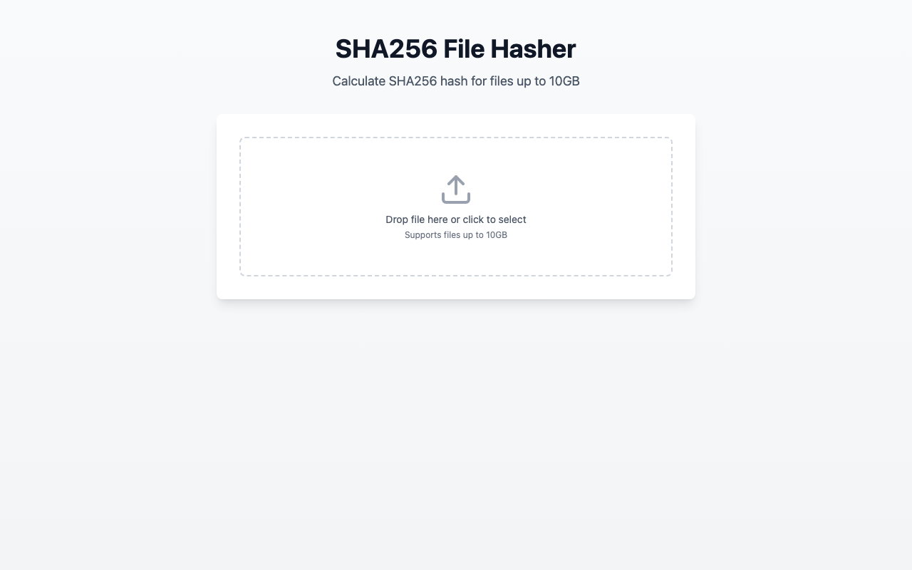
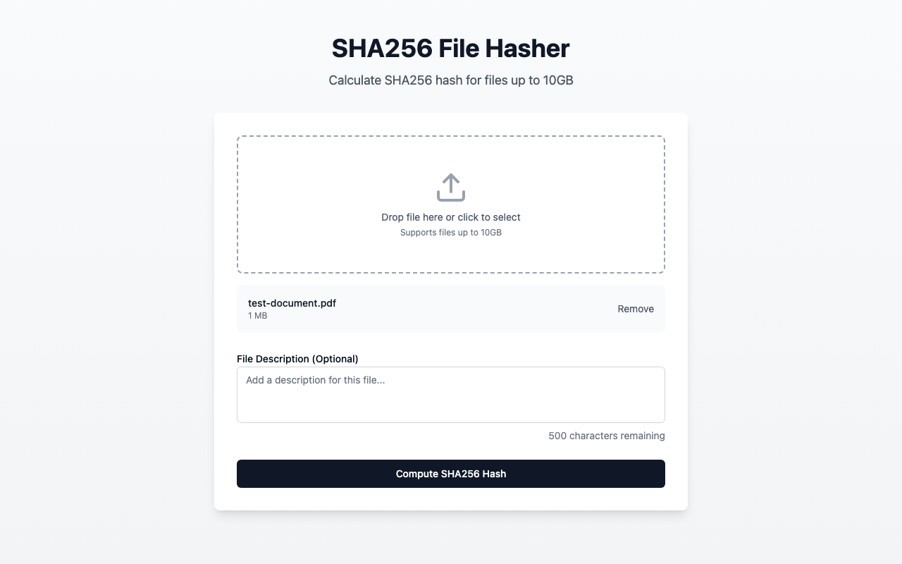
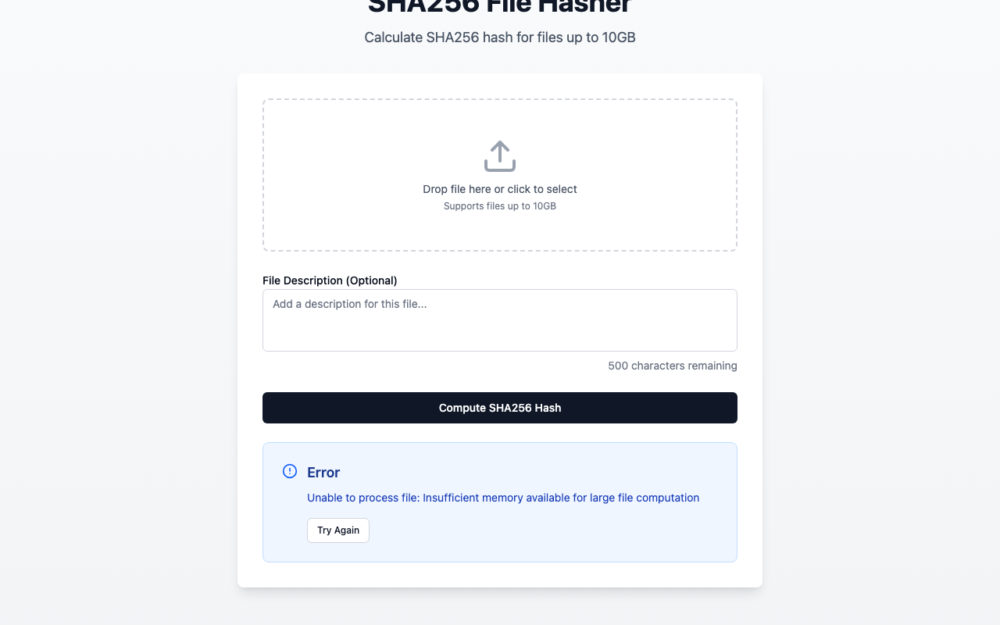

# SHA256 File Hasher

A TypeScript React application that calculates SHA256 hashes for files up to 10GB with a non-blocking UI.

## Features

- ✅ SHA256 hash calculation for files up to 10GB
- ✅ Non-blocking UI (Web Workers)
- ✅ File description input (500 character limit)
- ✅ Progress bar showing computation progress
- ✅ Drag & drop file upload
- ✅ Error handling with retry functionality
- ✅ Copy hash to clipboard
- ✅ Comprehensive test coverage (35+ tests)

## Tech Stack

- **React 18** + **TypeScript 5**
- **Vite** - Build tool
- **Tailwind CSS v4** - Styling
- **Zustand** - State management
- **crypto-js** - SHA256 computation with streaming
- **Vitest** + **React Testing Library** - Unit & integration tests
- **Playwright** - E2E tests

## Getting Started

### Install Dependencies

```bash
pnpm install
```

### Development

```bash
pnpm dev
```

### Build

```bash
pnpm build
```

### Preview Production Build

```bash
pnpm preview
```

## Screenshots

### Main Screen - File Upload



### File Selected with Information



### Description Input


### Hashing in Progress


### Results Page


### Error Handling



When an error occurs during hash computation, the application displays a clear error message with a "Try Again" button that resets the application to its initial state, allowing users to retry with a different file.

## Demo Video

Watch the **complete continuous typing workflow with a 775MB file**:

**[📹 Large File Continuous Typing Demo](tests/e2e-videos/large-file-supports-continuous-typing-workflow-before-during-after.webm)** (308KB video)

This E2E test demonstrates:

- ✅ Typing description **before** hashing starts
- ✅ Typing description **during** computation (while monitoring progress)
- ✅ **Auto-focus** on results page
- ✅ Typing description **after** completion
- ✅ Real-world large file (775MB video)
- ✅ No worker crashes or UI hangs

## Testing

### Unit & Integration Tests

The project includes comprehensive test coverage with **43 total tests**:

- **Unit Tests (11)**: Utility functions (`format-bytes`, `validate-file`)
- **Integration Tests (14)**: Widget components tested through full HashWidget
- **E2E Tests (18)**: Complete application workflows

```bash
# Run all unit & integration tests
pnpm test

# Run tests with UI
pnpm test:ui

# Run tests with coverage
pnpm test:coverage
```

**Note**: Component tests are now integration tests because the widget uses isolated Zustand instances. Components are tested by rendering the full `HashWidget` and interacting with it.

### E2E Tests

```bash
# Run E2E tests (no video recording - faster)
pnpm test:e2e

# Run E2E tests with video recording
pnpm test:e2e:video

# Run E2E tests without video recording
pnpm test:e2e:no-video

# Run E2E tests with Playwright UI
pnpm test:e2e:ui
```

## How It Works

### 10GB File Handling

The application can handle files up to 10GB without loading them entirely into memory:

1. **File API Reference** - The browser keeps a reference to the file on disk
2. **Chunked Reading** - Files are read in 64MB chunks using `File.slice()`
3. **Streaming Hash** - Each chunk is processed and the hash is updated incrementally
4. **Web Worker** - Hash computation runs in a background thread to keep UI responsive
5. **Memory Efficient** - Only ~100-200MB memory usage regardless of file size

### Architecture

```
Main Thread (UI)          Web Worker (Background)
─────────────            ──────────────────────
FileUploader
    │
    ├─> Select File
    │
DescriptionInput
    │
ComputeButton
    │
    ├─────────────────────> Start Hashing
                               │
ProgressBar                    ├─> Read 64MB chunk
    │                          ├─> Update hash
    │<─────────────────────    ├─> Send progress (5%)
    │                          ├─> Read next chunk
    │<─────────────────────    ├─> Send progress (10%)
    │                          └─> ... repeat ...
ResultsDisplay
    │<─────────────────────    Final Hash
```

## Project Structure

```
src/
├── app/
│   ├── app.tsx                       # Root component
│   ├── layout/
│   │   └── layout.tsx                # Shared layout component
│   ├── theme/
│   │   └── theme.css                 # Tailwind CSS
│   ├── test/
│   │   └── setup.ts                  # Test setup
│   └── utils/
│       └── cn.ts                     # Utility functions
├── features/
│   └── hash-computation/
│       ├── hash-computation.page.tsx # Page component
│       └── widgets/
│           └── hash-widget/          # Reusable hash widget
│               ├── hash-widget.tsx   # Widget entry point
│               ├── hash-computation.const.ts
│               ├── hash-computation.types.ts
│               ├── state/
│               │   ├── hash.state.ts            # Legacy global store
│               │   ├── hash-widget.store.ts     # Store factory
│               │   └── hash-widget.context.tsx  # Internal context
│               ├── hooks/
│               │   └── use-hash-worker.ts       # Worker hook
│               ├── workers/
│               │   ├── hash.worker.ts           # SHA256 Web Worker
│               │   └── hash.worker.types.ts
│               ├── utils/
│               │   ├── format-bytes.ts
│               │   ├── format-bytes.test.ts
│               │   ├── validate-file.ts
│               │   └── validate-file.test.ts
│               └── ui/
│                   ├── file-uploader.tsx
│                   ├── file-uploader.test.tsx
│                   ├── description-input.tsx
│                   ├── description-input.test.tsx
│                   ├── compute-button.tsx
│                   ├── cancel-button.tsx
│                   ├── cancel-button.test.tsx
│                   ├── progress-bar.tsx
│                   ├── results-display.tsx
│                   └── error-display.tsx
├── ui/                               # Shared UI components
│   ├── button.tsx
│   ├── textarea.tsx
│   ├── label.tsx
│   └── progress.tsx
└── main.tsx                          # Entry point

tests/                                # All test-related files
├── e2e/                              # E2E test specs
│   ├── hash-computation.spec.ts
│   ├── error-handling.spec.ts
│   ├── large-file.spec.ts
│   └── mock/                         # Large test files
├── e2e-videos/                       # Demo videos (18 videos)
├── screenshots/                      # App screenshots (7 images)
├── scripts/
│   └── capture-screenshots.ts        # Screenshot automation
├── playwright-report/                # Test reports
└── test-results/                     # Playwright test results
```

## Documentation

- `docs/IMPLEMENTATION_SPEC.md` - Complete technical specification
- `docs/MY_PROMPTS.md` - Specification development process
- `docs/TEST_REQUIREMENTS_VERIFICATION.md` - Test coverage verification

## License

MIT
